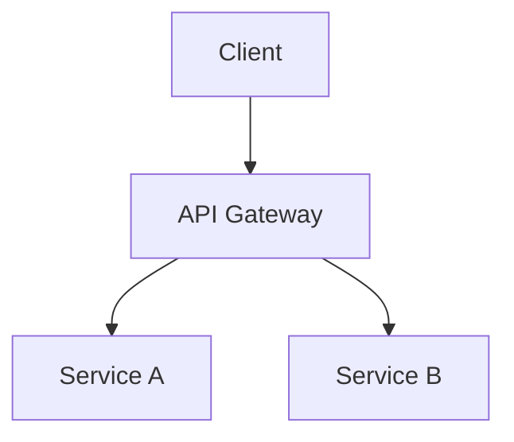

# Architecture Documentation Workflow

**Goal:** Document system architecture and design decisions

**Phase:** Cross-phase (Documentation)

**Agent:** Tech Writer

**Trigger keywords:** architecture docs, document architecture, system documentation, adr, architecture decision

**Inputs:** Architecture design, system components, ADRs

**Output:** Architecture documentation

**Duration:** 30-60 minutes

---

## When to Use

- After completing system design
- Onboarding new team members
- Before major refactoring
- Recording architectural decisions

**Invoke:** `/architecture-docs`

---

## Pre-Flight

1. **Review existing architecture** - docs/architecture-*.md
2. **Identify components** - What needs documenting
3. **Check ADRs** - Existing decision records
4. **Determine audience** - New devs, external teams, future self

---

## Documentation Types

### 1. System Overview

High-level view of the system.

**Content:**
- Purpose and scope
- Key components
- External dependencies
- Technology stack

**Format:**
```markdown
# System Architecture

## Overview
Brief description of the system.

## Components
- Component A: Purpose
- Component B: Purpose

## Technology Stack
| Layer | Technology |
|-------|------------|
| Frontend | React |
| Backend | Node.js |
| Database | PostgreSQL |
```

### 2. Component Documentation

Detailed view of each component.

**Content:**
- Responsibilities
- Interfaces (APIs, events)
- Dependencies
- Data models

### 3. Data Flow Documentation

How data moves through the system.

**Content:**
- Request flows
- Event flows
- Data transformations

### 4. Architecture Decision Records (ADRs)

Document significant decisions.

**Format:**
```markdown
# ADR-001: [Decision Title]

## Status
Accepted | Superseded | Deprecated

## Context
What is the issue we're seeing?

## Decision
What did we decide to do?

## Consequences
What are the results of this decision?
```

---

## Workflow Steps

### Step 1: Audit Current Documentation

Check what exists:
- [ ] System overview
- [ ] Component descriptions
- [ ] Data models
- [ ] API documentation
- [ ] ADRs

### Step 2: Identify Gaps

What's missing or outdated?

| Document | Status | Action |
|----------|--------|--------|
| Overview | Outdated | Update |
| Components | Missing | Create |
| ADRs | Partial | Add new decisions |

### Step 3: Create/Update Documentation

**System Overview:**
1. Describe purpose
2. List components
3. Show high-level diagram
4. Note key decisions

**Component Docs:**
1. Describe responsibility
2. List interfaces
3. Document dependencies
4. Include usage examples

**ADRs:**
1. Title the decision
2. Provide context
3. State the decision
4. List consequences

### Step 4: Add Diagrams

**Recommended diagrams:**
- System context (C4 Level 1)
- Container diagram (C4 Level 2)
- Data flow diagrams
- Sequence diagrams for key flows

Use Mermaid for inline diagrams:


---

## Output Structure

```
docs/
├── architecture/
│   ├── overview.md
│   ├── components/
│   │   ├── service-a.md
│   │   └── service-b.md
│   ├── data-flow.md
│   └── adrs/
│       ├── ADR-001-database-choice.md
│       └── ADR-002-api-versioning.md
```

---

## Definition of Done

- [ ] System overview complete
- [ ] All major components documented
- [ ] Key decisions recorded as ADRs
- [ ] Diagrams included where helpful
- [ ] No placeholder content

---

## HALT Conditions

Stop the workflow and notify user if:

| Condition | Message | Recovery |
|-----------|---------|----------|
| No architecture exists | "Cannot document architecture that doesn't exist." | Run `/architecture` first |
| No components defined | "No system components identified to document." | Define components |
| Outdated source docs | "Source architecture docs appear outdated." | Update architecture first |
